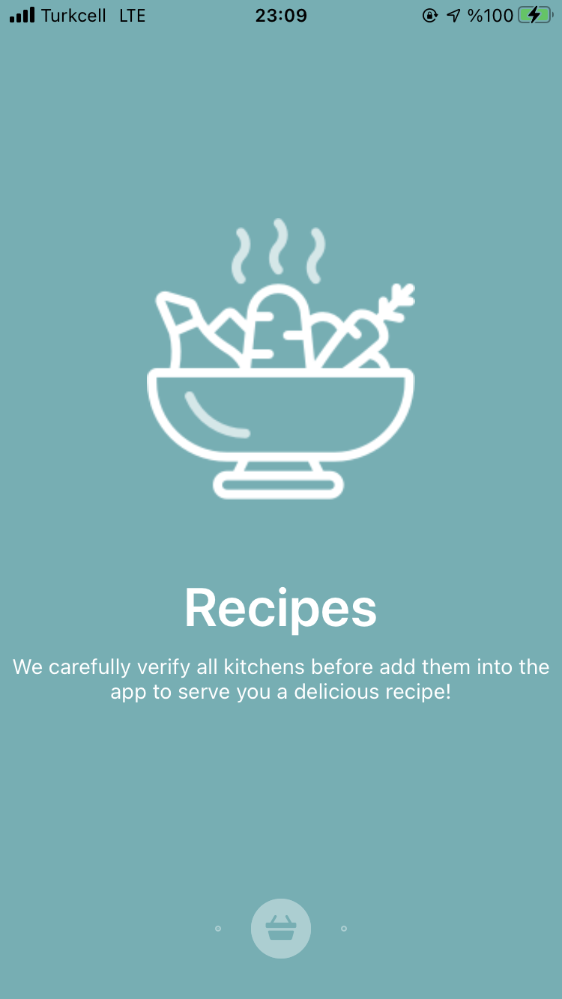

 [](https://developer.apple.com/swift/)

# Banabi Kitchen 
#### *FinalRestaurantProject for Yemeksepeti iOS Bootcamp*

<div align="center">
    
</div>

## Table of Contents
- <a href="#description">Description</a>
- <a href="#tech-stack">Tech Stack</a>
- <a href="#libraries">Libraries</a>
- <a href="#implementation-and-features">Implementation and Features</a>
- <a href="#requirements">Requirements</a>
- <a href="#previews-for-usage">Previews for Usage</a>
- <a href="#license">License</a>

## Description

Banabi Kitchen is a final project for the Yemeksepeti iOS Bootcamp. The project was created to simulate a food ordering app which is mimicking the Yemeksepeti. But it's a little bit different from the food ordering apps we already know. Instead of ordering the foods from the restraurants' specific menus, now you can crate your own recipes (inherited from your grandma maybe!), and you will get an offer for your selected or created recipe from different kitchens which are able to cook your meal! These kitchens were designed as Banabi - associated restaurants which can willing to serve you privately! 

## Tech Stack

* Firebase Realtime Database and Storage for backend
* MVVM, delegation patterns for bindings 
* Swift Package Manager
* MapKit
* CoreData, image caching
* Localization 
* Storyboard for UI design
* Image Picker Controller
* Some reusables views, empty state views, custom alerts, activity indicators, proper searching, organized folder structure.

## Libraries

* PaperOnboarding https://github.com/Ramotion/paper-onboarding
* RAMAnimatedTabBarController https://github.com/Ramotion/animated-tab-bar
* StepIndicator https://github.com/chenyun122/StepIndicator
* Firebase Database, Firebase Storage https://github.com/firebase/firebase-ios-sdk
* WSTagsField https://github.com/whitesmith/WSTagsField

## Implementation and Features

| Launch Screen | Onboarding Screen | Home Screen1 | Home Screen2 | Create Recipe Screen |      
| --- | --- | --- | --- | --- | 
|  |  |  |  |  | 
| Go through Kitchen! | Welcome! | Home inludes the user's location, favorited recipes | and kitchens... | Users can create their own recipes and customize them any time they want by defining the instructions, images, ingredients and name of the recipe. Ingredients part was implemented as tag style!| 


| Recipes Screen | Recipe Detail Screen1 | Recipe Detail Screen2  | Edit Recipe Screen | Image picker |       
| --- | --- | --- | --- | --- | 
|  |  |  |  |  |  
| Users can search among the  recipes according to their name. | Users can like or unlike any recipe to add or delete from their own recipes. | Recipes can be directly ordered or you can edit(by clicking right bottom of the image, pencil-like blue button is there!) them depending on your own taste! | Edit anywhere and save it to your list! Then you can order it ;)| You can pick a picture for your delicious recipe either by using your own camera or your photo library. |

| Kitchens Screen | Empty View | Map View | Kitchen Detail Screen |    
| --- | --- | --- | --- | 
|  |  |  |  | 
| Users can also search among the kitchens by their name.| Oops! Search again! | You can see the locations of every single kitchen and when you tap one them you can go their detail screen.| Users can see kitchens' recipes and details (ratings, locations, descriptions, etc.). | 


| Get Offer Screen | Payment Screen | Order Success View | Order Status Screen |    
| --- | --- | --- | --- | 
|  |  |  |  | 
|Users can order a meal from kitchens by getting offers from available kitchens, depending on the estimated delivery time and cost of the service. Kitchens also have rating numbers and counts to represent a quality of their services. Offered data from kitchens only made by simulation purposes meaning that they are only mocked data to simulate the scenario.| Simulates the payment process.| Successfully paid! | After order your meal, you can see a available button in the middle of the homepage, and when you go through it, you can follow your order detail! (This is only a simulation) | 

## Requirements

* Xcode 12.5
* Swift 5
* iOS 14.5
* Only portrait mode 

## Previews for Usage 

| Onboarding Screen | Recipes & Orders Screen | Kitchens Screen |   
| --- | --- | --- | 
|  |  |  | 


## License
```
Copyright (c) 2021 Gizem Boskan

Permission is hereby granted, free of charge, to any person obtaining a copy
of this software and associated documentation files (the "Software"), to deal
in the Software without restriction, including without limitation the rights
to use, copy, modify, merge, publish, distribute, sublicense, and/or sell
copies of the Software, and to permit persons to whom the Software is
furnished to do so, subject to the following conditions:

The above copyright notice and this permission notice shall be included in all
copies or substantial portions of the Software.

THE SOFTWARE IS PROVIDED "AS IS", WITHOUT WARRANTY OF ANY KIND, EXPRESS OR
IMPLIED, INCLUDING BUT NOT LIMITED TO THE WARRANTIES OF MERCHANTABILITY,
FITNESS FOR A PARTICULAR PURPOSE AND NONINFRINGEMENT. IN NO EVENT SHALL THE
AUTHORS OR COPYRIGHT HOLDERS BE LIABLE FOR ANY CLAIM, DAMAGES OR OTHER
LIABILITY, WHETHER IN AN ACTION OF CONTRACT, TORT OR OTHERWISE, ARISING FROM,
OUT OF OR IN CONNECTION WITH THE SOFTWARE OR THE USE OR OTHER DEALINGS IN THE
SOFTWARE.
```
